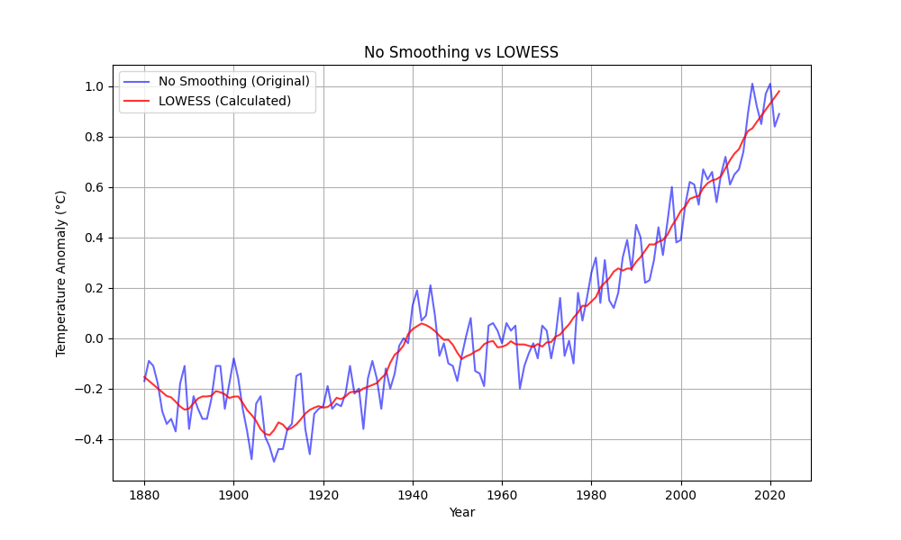

# 1 Python程序设计#4作业
**班级**: 2022211305  

**学号**: 2022211683

**姓名**: 张晨阳

## 1.1 作业题目
基于#3作业获取的数据（No_Smoothing，非平滑数据），计算出LOWESS（局部加权回归，fraction取前后各5年的数据）结果，该结果可以与#2作业中提供的graph.txt文件中的Lowess字段进行比较。

## 1.2 作业内容
程序源代码嵌入下方的code block中。

```python
import aiohttp
import asyncio
import numpy as np
import matplotlib.pyplot as plt


class QueryClient:
    def __init__(self, base_url):
        self.base_url = base_url

    async def fetch_data(self, endpoint, params):
        """
        请求服务端数据
        """
        async with aiohttp.ClientSession() as session:
            async with session.get(f"{self.base_url}/{endpoint}", params=params) as response:
                if response.status == 200:
                    return await response.json()  # 直接解析为 JSON
                else:
                    raise Exception(f"Failed to fetch data: {response.status}")

    async def query_no_smoothing(self, start_year, end_year, order):
        """
        获取 No_Smoothing 数据
        """
        endpoint = "query/json"
        params = {
            "start_year": start_year,
            "end_year": end_year,
            "order": order
        }
        data = await self.fetch_data(endpoint, params)
        return [(entry["Year"], entry["No_Smoothing"]) for entry in data]


def simple_lowess(x, y, frac=0.1):
    """
    简单实现 LOWESS 算法
    """
    n = len(x)
    span = int(np.ceil(frac * n))  # 窗口大小
    y_smoothed = np.zeros(n)

    for i in range(n):
        distances = np.abs(x - x[i])
        weights = np.exp(-distances**2 / (2 * (distances.max() / 2)**2))

        indices = np.argsort(distances)[:span]
        x_window = x[indices]
        y_window = y[indices]
        weights_window = weights[indices]

        b = np.polyfit(x_window, y_window, 1, w=weights_window)
        y_smoothed[i] = b[0] * x[i] + b[1]

    return list(zip(x, y_smoothed))


def calculate_lowess(data, frac=0.1):
    """
    计算 LOWESS 平滑结果
    """
    years, values = zip(*data)
    return simple_lowess(np.array(years), np.array(values), frac=frac)


async def main():
    client = QueryClient("http://localhost:8000")

    # 获取 No_Smoothing 数据并按年份排序
    no_smoothing_data = sorted(await client.query_no_smoothing(1880, 2022, "asc"), key=lambda x: x[0])

    # 计算 LOWESS 平滑曲线，确保滑动窗口为 ±5 年
    lowess_result = calculate_lowess(
        no_smoothing_data, frac=11 / len(no_smoothing_data))

    # 打印对比结果
    print("\nYear    No_Smoothing   LOWESS_Calculated")
    for (year, no_smoothing), (lowess_year, lowess_value) in zip(no_smoothing_data, lowess_result):
        print(f"{year:<7} {no_smoothing:<14} {lowess_value:<16.2f}")

    # 可视化对比
    years, no_smoothing_values = zip(*no_smoothing_data)
    _, lowess_values = zip(*lowess_result)

    plt.figure(figsize=(10, 6))
    plt.plot(years, no_smoothing_values,
             label="No Smoothing (Original)", color="blue", alpha=0.6)
    plt.plot(years, lowess_values, label="LOWESS (Calculated)",
             color="red", alpha=0.8)
    plt.title("No Smoothing vs LOWESS")
    plt.xlabel("Year")
    plt.ylabel("Temperature Anomaly (°C)")
    plt.legend()
    plt.grid()
    plt.show()

if __name__ == "__main__":
    asyncio.run(main())
```

## 1.3 代码说明

### **代码功能概述**

本代码实现了基于**作业 3 获取的 `No_Smoothing` 数据**，按照时间序列对数据进行**LOWESS（局部加权回归）**平滑处理，并将计算结果与原始数据进行对比。主要包括以下功能：

- **从服务端获取数据**：
  - 使用 `aiohttp` 异步库调用服务端提供的 API，获取 `No_Smoothing` 数据。
  - 数据按年份排序，确保符合时间序列的要求。
- **LOWESS 平滑计算**：
  - 实现了一个简单的 LOWESS 算法，支持滑动窗口大小的自定义。
  - 按要求设置滑动窗口大小为前后各 5 年（共 11 年的数据）。
- **数据对比与可视化**：
  - 打印 `Year`、`No_Smoothing` 和 `LOWESS` 计算结果。
  - 使用 `matplotlib` 绘制原始数据和 LOWESS 曲线的对比图。


### **代码模块说明**

#### **1. QueryClient 类**

用于通过服务端 API 获取 `No_Smoothing` 数据，包含以下方法：
- **`__init__`**：初始化服务端基础地址。
- **`fetch_data`**：发送异步 HTTP GET 请求并返回 JSON 格式的响应数据。
- **`query_no_smoothing`**：调用服务端接口，按年份范围获取 `(Year, No_Smoothing)` 数据。

#### **2. LOWESS 计算函数**

- **`simple_lowess`**：
  - 实现了一个简化的 LOWESS 算法，核心逻辑包括：
    1. 计算当前点与所有点的距离，使用高斯核函数生成权重。
    2. 在滑动窗口内按权重拟合局部线性模型，得到平滑值。
  - 支持自定义滑动窗口大小，通过 `frac` 参数控制窗口比例。
  
- **`calculate_lowess`**：
  - 封装 `simple_lowess`，接收时间序列数据 `[(Year, No_Smoothing)]` 和 `frac` 参数，返回平滑结果。

#### **3. 数据处理与可视化**

- **数据排序**：
  - 使用 `sorted` 函数对 `No_Smoothing` 数据按年份排序，确保滑动窗口的时间依赖性。
- **数据对比**：
  - 打印每年的 `Year`、`No_Smoothing` 和计算的 `LOWESS` 值，直观展示数据差异。
- **可视化**：
  - 使用 `matplotlib` 绘制对比图：
    - 蓝线：原始 `No_Smoothing` 数据。
    - 红线：计算的 LOWESS 平滑曲线。


### **核心逻辑与参数**

1. **LOWESS 窗口大小设置**：
   - 窗口大小为前后 5 年（共 11 年）。
   - 通过 `frac = 11 / len(no_smoothing_data)` 动态计算滑动窗口比例，确保窗口与数据长度匹配。

2. **异步数据获取**：
   - 使用 `aiohttp` 提高服务端数据请求效率。
   - 使用 `await` 和 `async` 实现非阻塞的并发请求。

3. **时间序列排序**：
   - 确保原始数据和 LOWESS 结果都基于时间顺序排列，滑动窗口逻辑符合时间序列要求。


### **输出结果说明**

#### **1. 数据对比打印**
- 格式化输出每年的 `Year`、`No_Smoothing` 和 `LOWESS` 值：
  ```plaintext
  Year    No_Smoothing   LOWESS_Calculated
  1880    -0.17          -0.15           
  1881    -0.09          -0.17           
  1882    -0.11          -0.18           
  ...
  2022     0.89           0.98           
  ```
#### **2. 图形对比**
- **横轴**：年份（Year）。
- **纵轴**：温度异常值（Temperature Anomaly）。
- **曲线对比**：
  - 蓝色：原始 `No_Smoothing` 数据。
  - 红色：LOWESS 平滑曲线。

