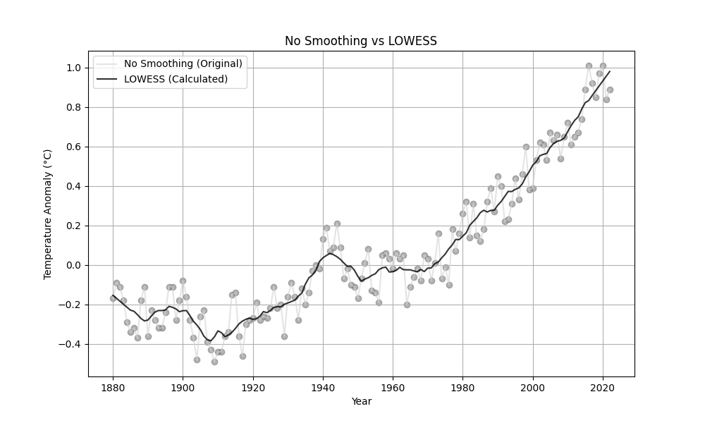

# 1 Python程序设计#5作业
**班级**: 2022211305  

**学号**: 2022211683

**姓名**: 张晨阳

## 1.1 作业题目
基于#3作业、#4作业获取的No_Smoothing、Lowess数据项，在同一个图上分别绘制出折线图（No_Smoothing）和平滑线图（Lowess）。绘制结果对照参考图片（test.png）。

## 1.2 作业内容
程序源代码嵌入下方的code block中。

```python
import aiohttp
import asyncio
import numpy as np
import matplotlib.pyplot as plt


class QueryClient:
    def __init__(self, base_url):
        self.base_url = base_url

    async def fetch_data(self, endpoint, params):
        """
        请求服务端数据
        """
        async with aiohttp.ClientSession() as session:
            async with session.get(f"{self.base_url}/{endpoint}", params=params) as response:
                if response.status == 200:
                    return await response.json()  # 直接解析为 JSON
                else:
                    raise Exception(f"Failed to fetch data: {response.status}")

    async def query_no_smoothing(self, start_year, end_year, order):
        """
        获取 No_Smoothing 数据
        """
        endpoint = "query/json"
        params = {
            "start_year": start_year,
            "end_year": end_year,
            "order": order
        }
        data = await self.fetch_data(endpoint, params)
        return [(entry["Year"], entry["No_Smoothing"]) for entry in data]


def simple_lowess(x, y, frac=0.1):
    """
    简单实现 LOWESS 算法
    """
    n = len(x)
    span = int(np.ceil(frac * n))  # 窗口大小
    y_smoothed = np.zeros(n)

    for i in range(n):
        distances = np.abs(x - x[i])
        weights = np.exp(-distances**2 / (2 * (distances.max() / 2)**2))

        indices = np.argsort(distances)[:span]
        x_window = x[indices]
        y_window = y[indices]
        weights_window = weights[indices]

        b = np.polyfit(x_window, y_window, 1, w=weights_window)
        y_smoothed[i] = b[0] * x[i] + b[1]

    return list(zip(x, y_smoothed))


def calculate_lowess(data, frac=0.1):
    """
    计算 LOWESS 平滑结果
    """
    years, values = zip(*data)
    return simple_lowess(np.array(years), np.array(values), frac=frac)


async def main():
    client = QueryClient("http://localhost:8000")

    no_smoothing_data = sorted(await client.query_no_smoothing(1880, 2022, "asc"), key=lambda x: x[0])

    lowess_result = calculate_lowess(
        no_smoothing_data, frac=11 / len(no_smoothing_data))

    years, no_smoothing_values = zip(*no_smoothing_data)
    _, lowess_values = zip(*lowess_result)

    plt.figure(figsize=(10, 6))

    plt.plot(years, no_smoothing_values,
             label="No Smoothing (Original)", color="lightgray", alpha=0.6)
    plt.scatter(years, no_smoothing_values,
                color="gray", alpha=0.6)  # 点的颜色

    plt.plot(years, lowess_values, label="LOWESS (Calculated)",
             color="black", alpha=0.8)

    plt.title("No Smoothing vs LOWESS")
    plt.xlabel("Year")
    plt.ylabel("Temperature Anomaly (°C)")
    plt.legend()
    plt.grid()
    plt.savefig('test.png')
    plt.show()


if __name__ == "__main__":
    asyncio.run(main())
```

## 1.3 代码说明

### 代码功能概述
本代码实现了从服务器获取温度异常数据（No Smoothing）并计算该数据的LOWESS（局部加权回归）平滑结果。最终，代码将通过`matplotlib`绘制温度异常数据（No Smoothing）和LOWESS平滑曲线的对比图，图中包含原始数据点和LOWESS平滑曲线。

### 代码模块说明

#### 1. `QueryClient` 类
该类用于与远程服务器交互，获取温度异常数据。
- `__init__(self, base_url)`: 初始化查询客户端，设置基本URL。
- `fetch_data(self, endpoint, params)`: 发送HTTP GET请求，并解析返回的JSON数据。
- `query_no_smoothing(self, start_year, end_year, order)`: 获取给定年份范围内的 `No_Smoothing` 数据。

#### 2. `simple_lowess(x, y, frac=0.1)` 函数
该函数实现了简单的LOWESS算法。它通过加权回归平滑原始数据。
- `x`: 输入的年份数据。
- `y`: 输入的温度异常数据。
- `frac`: 窗口大小，决定平滑的程度。默认为10%。

#### 3. `calculate_lowess(data, frac=0.1)` 函数
该函数用于计算LOWESS平滑曲线，返回平滑后的数据。
- `data`: 输入的数据，是一个包含年份和温度异常的元组列表。
- `frac`: 窗口大小，默认为10%。

#### 4. `main()` 函数
- 从服务器获取温度异常数据，并进行排序。
- 使用`calculate_lowess`计算LOWESS平滑曲线。
- 绘制原始数据（No Smoothing）与平滑数据（LOWESS）的对比图。

### 核心逻辑与参数
- `frac`参数决定了LOWESS算法的平滑程度。通过调整`frac`的值，可以控制滑动窗口的大小，从而影响平滑曲线的光滑度。较小的`frac`值会使曲线更为细致，较大的`frac`值则会导致平滑曲线更为平滑。
- `simple_lowess`函数使用加权回归（局部加权回归）来平滑数据。在每个数据点周围，计算与该点的加权距离，并根据加权回归公式得出新的平滑值。

### 输出结果说明
- 本代码通过`matplotlib`绘制了两个图像：一个是原始的温度异常数据（No Smoothing），一个是经过LOWESS平滑的温度异常数据。
- 原始数据以灰色点标出，并且点之间使用浅灰色连线表示。LOWESS平滑结果则使用黑色线条表示。
- 图中横轴表示年份，纵轴表示温度异常值（单位：°C）。

### 代码输出：
- 一幅包含两条曲线的图，左侧是原始数据，右侧是平滑后的LOWESS曲线。通过这两条曲线的对比，能够清楚地看到LOWESS平滑后的数据趋势。


