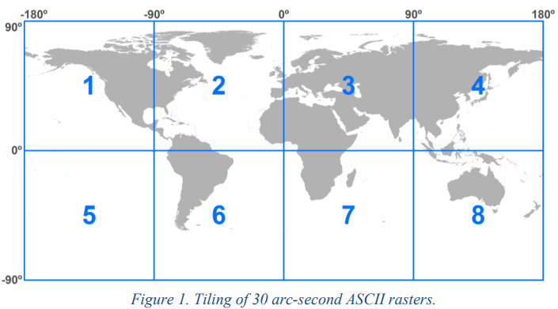
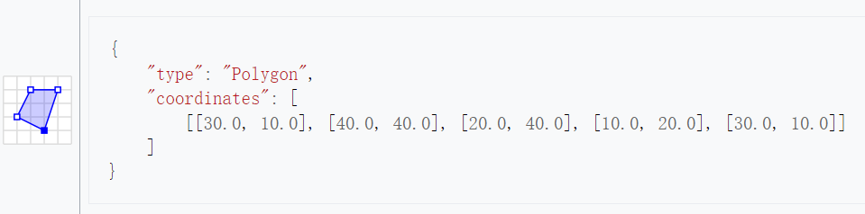
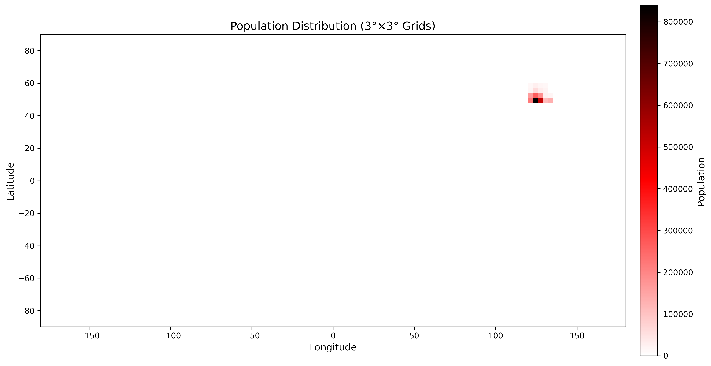
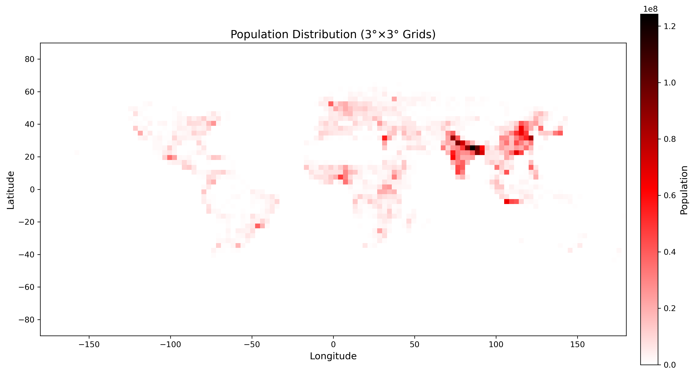
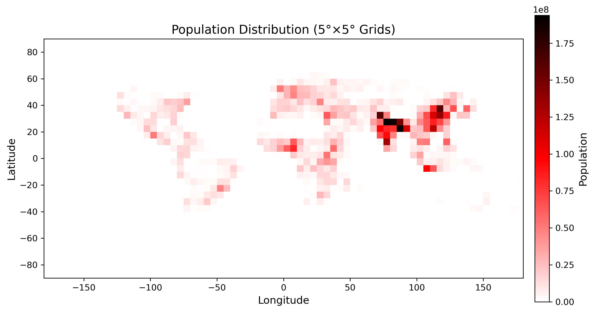

# 1 Python程序设计-大作业
**班级**: 2022211305  

**学号**: 2022211683

**姓名**: 张晨阳

## 1.1 作业题目
### 1.1.1 数据 
gpw-v4-population-count-rev11_2020_30_sec_asc.zip是一个全球人口分布数据压缩文件，解压后包括了8个主要的asc后缀文件，他们是全球网格化的人口分布数据文件，这些文件分别是：
- gpw-v4-population-count-rev11_2020_30_sec_1.asc
- gpw-v4-population-count-rev11_2020_30_sec_2.asc
- gpw-v4-population-count-rev11_2020_30_sec_3.asc
- gpw-v4-population-count-rev11_2020_30_sec_4.asc
- gpw-v4-population-count-rev11_2020_30_sec_5.asc
- gpw-v4-population-count-rev11_2020_30_sec_6.asc
- gpw-v4-population-count-rev11_2020_30_sec_7.asc
- gpw-v4-population-count-rev11_2020_30_sec_8.asc 

这些文件分布对应地球不同经纬度的范围。

压缩文件下载网页：https://sedac.ciesin.columbia.edu/data/set/gpw-v4-population-count-rev11/data-download

### 1.1.2 服务端 
压缩文件（gpw-v4-population-count-rev11_2020_30_sec_asc.zip）是一个全球人口分布数据。基于Sanic实现一个查询服务，服务包括：
- 按给定的经纬度范围查询人口总数，查询结果采用JSON格式。
- 不可以采用数据库，只允许使用文件方式存储数据。
- 可以对现有数据进行整理以便加快查询速度，尽量提高查询速度。

查询参数格式 采用GeoJSON（https://geojson.org/）的多边形（每次只需要查询一个多边形范围，只需要支持凸多边形）


### 1.1.3 客户端 
针对上面的查询服务，实现一个服务查询客户端，数据获取后使用Matplotlib散点图（Scatter）进行绘制。
- 横坐标（x轴）为经度。
- 纵坐标（y轴）为维度。

## 1.2 服务端代码 
程序源代码嵌入下方的code block中。
```python
from sanic import Sanic, response
import json
from shapely.geometry import shape, box

app = Sanic("PopulationQueryService")

# 预处理文件路径
population_file = "/mnt/new_disk/dh/zcy/final/src/population_3x3_degree.json"

# 加载人口数据
with open(population_file, "r") as f:
    population_data = json.load(f)

# 转换人口数据为更高效的字典
grid_population = {}
for key, value in population_data.items():
    # 解析 JSON 的元组字符串为浮点数元组
    key_tuple = tuple(map(float, key.strip("()").split(", ")))
    grid_population[key_tuple] = value


@app.post("/query")
async def query_population(request):
    try:
        geojson = request.json
        polygon = shape(geojson)  # 使用 shapely 解析 GeoJSON 多边形
        intersected_grids = []

        # 遍历所有网格数据，计算与多边形的交集及人口占比
        for (lon_min, lat_min, lon_max, lat_max), population in grid_population.items():
            grid_box = box(lon_min, lat_min, lon_max, lat_max) 
            intersection = polygon.intersection(grid_box)  # 计算交集

            if not intersection.is_empty:  # 如果交集不为空
                # 计算交集面积与栅格面积的比例
                grid_area = grid_box.area  # 栅格面积
                intersected_area = intersection.area  # 交集面积
                proportion = intersected_area / grid_area

                # 根据交集比例调整人口数
                adjusted_population = population * proportion

                # 保存结果
                intersected_grids.append({
                    "grid": [lon_min, lat_min, lon_max, lat_max],
                    "population": adjusted_population,
                    "proportion": proportion
                })

        return response.json({"grids": intersected_grids})
    except Exception as e:
        return response.json({"error": str(e)}, status=400)

if __name__ == "__main__":
    app.run(host="0.0.0.0", port=8000)
```

### 1.2.1 代码说明 
**1. 加载预处理数据**
```python
# 加载人口数据
with open(population_file, "r") as f:
    population_data = json.load(f)

# 转换人口数据为更高效的字典
grid_population = {}
for key, value in population_data.items():
    # 解析 JSON 的元组字符串为浮点数元组
    key_tuple = tuple(map(float, key.strip("()").split(", ")))
    grid_population[key_tuple] = value
```
**功能：**

- 从 JSON 文件中加载人口数据，文件格式为预处理后生成的网格数据。

- 将 JSON 中的字符串键（表示网格边界）解析为浮点数元组 `(lon_min, lat_min, lon_max, lat_max)`。

- 将数据存储为字典 `grid_population`，键为网格的边界元组，值为该网格的人口数。

**2. 接收请求与解析多边形**
```python
geojson = request.json
polygon = shape(geojson)  # 使用 shapely 解析 GeoJSON 多边形
```
**功能：**
- 从客户端接收到的 POST 请求中读取 GeoJSON 格式的查询多边形。

- 使用 Shapely 的 `shape` 方法将 GeoJSON 转换为多边形对象。

**3. 遍历网格并计算交集**
```python
for (lon_min, lat_min, lon_max, lat_max), population in grid_population.items():
    grid_box = box(lon_min, lat_min, lon_max, lat_max)
    intersection = polygon.intersection(grid_box)
```
**功能：**
- 遍历所有预处理的网格，逐一构造网格的多边形对象 `grid_box`。

- 使用 Shapely 的 `intersection` 方法计算查询多边形与当前网格的交集。

**4. 计算人口比例并调整**
```python
if not intersection.is_empty:  # 如果交集不为空
    grid_area = grid_box.area  # 栅格面积
    intersected_area = intersection.area  # 交集面积
    proportion = intersected_area / grid_area

    # 根据交集比例调整人口数
    adjusted_population = population * proportion
```
**功能：**
- 对于每个与查询多边形有交集的网格：

  - 计算网格面积和交集面积。

  - 根据面积比例调整网格人口数，得到查询范围内的有效人口。

**5. 返回查询结果**
```python
intersected_grids.append({
    "grid": [lon_min, lat_min, lon_max, lat_max],
    "population": adjusted_population,
    "proportion": proportion
})

return response.json({"grids": intersected_grids})
```
**功能：**
- 将查询范围内所有相关网格的人口数据和比例存入结果列表 `intersected_grids`。

- 返回包含网格人口信息的 JSON 响应，供客户端使用。


## 1.3 客户端代码 
客户端代码嵌入下发的code block中。
```python
import requests
import matplotlib.pyplot as plt
from matplotlib.patches import Rectangle
import matplotlib.colors as mcolors
import numpy as np

server_url = "http://localhost:8000/query"

geojson_polygon = {
    "type": "Polygon",
    "coordinates": [[
        [-180.0, -90.0], [180.0, -90.0], [180.0, 90.0], [-180.0, 90.0], [-180.0, -90.0]
    ]]
}

response = requests.post(server_url, json=geojson_polygon)
if response.status_code == 200:
    data = response.json()
    grids = data.get("grids", [])
    print(f"Received {len(grids)} grids from server.")
else:
    print(f"Error: {response.json()}")
    grids = []

if not grids:
    print("No data to plot.")
    exit()

valid_populations = [g["population"] for g in grids if g["population"] > 0]
if valid_populations:
    max_population = max(valid_populations)
else:
    max_population = 1  # 防止除以 0

colors = [(1, 1, 1), (1, 0, 0), (0, 0, 0)]  # RGB: 白色 -> 红色 -> 黑色
cmap = mcolors.LinearSegmentedColormap.from_list("custom_cmap", colors)

# 创建绘图
fig, ax = plt.subplots(figsize=(16, 8)) 
ax.set_xlim(-180, 180)
ax.set_ylim(-90, 90) 
ax.set_aspect('equal', adjustable='box')

for grid in grids:
    lon_min, lat_min, lon_max, lat_max = grid["grid"]
    population = grid["population"]

    if population > 0:
        color_intensity = population / max_population
    else:
        color_intensity = 0

    rect = Rectangle((lon_min, lat_min), lon_max - lon_min, lat_max - lat_min,
                     color=cmap(color_intensity), lw=0)  # 自定义颜色映射
    ax.add_patch(rect)

norm = mcolors.Normalize(vmin=0, vmax=max_population)
sm = plt.cm.ScalarMappable(cmap=cmap, norm=norm)
sm.set_array([]) 
cbar = plt.colorbar(sm, ax=ax, orientation='vertical', pad=0.02)
cbar.set_label("Population", fontsize=12)

plt.title("Population Distribution (3°×3° Grids)", fontsize=14)
plt.xlabel("Longitude", fontsize=12)
plt.ylabel("Latitude", fontsize=12)

save_path = "population_distribution_3x3.png"
plt.savefig(save_path, dpi=300, bbox_inches="tight")
plt.show()

print(f"Heatmap saved to {save_path}")
```

### 1.3.1 代码说明 
**1. 服务端请求与响应**
```python
response = requests.post(server_url, json=geojson_polygon)
if response.status_code == 200:
    data = response.json()
    grids = data.get("grids", [])
    print(f"Received {len(grids)} grids from server.")
else:
    print(f"Error: {response.json()}")
    grids = []
```
**实现思路：**

- 构造一个完整地图的 GeoJSON 多边形（覆盖全球范围）。

- 向服务端发送 POST 请求，将查询多边形作为 JSON 数据传递。

- 接收服务端返回的网格数据（包含网格坐标和人口信息）。

- 如果响应失败，捕获错误并打印相关信息。

**功能：**

- 从服务端动态获取查询范围内的网格人口数据，形成后续可视化的基础。

**2. 计算最大人口**
```python
valid_populations = [g["population"] for g in grids if g["population"] > 0]
if valid_populations:
    max_population = max(valid_populations)
else:
    max_population = 1  # 防止除以 0
```
**实现思路：**

- 遍历返回的网格数据，提取人口大于 0 的网格。

- 找到最大人口值，用于归一化颜色深度。

- 如果所有网格人口均为 0，默认设置最大人口值为 1，避免后续计算中出现除以 0 的问题。

**3. 定义自定义颜色映射**
```python
colors = [(1, 1, 1), (1, 0, 0), (0, 0, 0)]  # RGB: 白色 -> 红色 -> 黑色
cmap = mcolors.LinearSegmentedColormap.from_list("custom_cmap", colors)
```
**实现思路：**

- 自定义颜色映射，从白色（最低值）到红色（中间值），再到黑色（最高值）。

- 使用 `matplotlib.colors.LinearSegmentedColormap` 生成渐变颜色映射。

**4. 创建绘图区域**
```python
fig, ax = plt.subplots(figsize=(16, 8))  # 调整比例适配 3°×3° 的网格密度
ax.set_xlim(-180, 180)  # 设置经度范围
ax.set_ylim(-90, 90)    # 设置纬度范围
ax.set_aspect('equal', adjustable='box')  # 保持正方形格子
```
**实现思路：**

- 使用 `Matplotlib` 创建绘图区域，设置经纬度范围覆盖全球。

- 调整图形比例以适配 3°×3° 的网格密度。

- 保证网格绘制为正方形，通过设置 `aspect='equal'`。

**5. 绘制网格**
```python
for grid in grids:
    lon_min, lat_min, lon_max, lat_max = grid["grid"]
    population = grid["population"]

    if population > 0:
        color_intensity = population / max_population
    else:
        color_intensity = 0

    rect = Rectangle((lon_min, lat_min), lon_max - lon_min, lat_max - lat_min,
                     color=cmap(color_intensity), lw=0)
    ax.add_patch(rect)
```
**实现思路：**

- 遍历服务端返回的每个网格，提取网格的边界和人口信息。

- 根据人口数量计算颜色深度，将人口比例归一化到 `[0, 1]` 范围。

- 使用 `Matplotlib` 的 `Rectangle` 绘制每个网格，填充颜色为对应的渐变值。

- 设置边框宽度为 0，避免干扰视觉效果。

## 1.4 数据预处理代码
数据预处理代码嵌入下发的code block中。
```python
import os
import rasterio
from rasterio.features import geometry_mask
from shapely.geometry import box
import numpy as np
import json
import concurrent.futures

# 配置输入输出路径
input_folder = "/mnt/new_disk/dh/zcy/final/gpw-v4-population-count-rev11_2020_30_sec_asc/"
output_file = "population_3x3_degree.json"

GRID_SIZE = 3

grid_population_data = {}


def load_raster_files():
    """加载所有的ASC文件，并提取相关的元数据"""
    raster_files = []
    for filename in os.listdir(input_folder):
        if filename.endswith(".asc"):
            file_path = os.path.join(input_folder, filename)
            with rasterio.open(file_path) as src:
                bounds = src.bounds
                transform = src.transform
                nodata = src.nodata
                shape = src.shape

                if transform.is_identity:
                    print(
                        f"Skipping file {file_path} due to missing geotransform.")
                    continue

                raster_files.append({
                    "path": file_path,
                    "bounds": box(bounds.left, bounds.bottom, bounds.right, bounds.top),
                    "transform": transform,
                    "nodata": nodata,
                    "shape": shape
                })
    return raster_files


raster_files = load_raster_files()


def generate_grid():
    """生成全球5°x5°的经纬度网格"""
    grid = []
    lon_min, lon_max = -180, 180
    lat_min, lat_max = -90, 90
    for lon in np.arange(lon_min, lon_max, GRID_SIZE):
        for lat in np.arange(lat_min, lat_max, GRID_SIZE):
            grid.append(box(lon, lat, lon + GRID_SIZE, lat + GRID_SIZE))
    return grid


global_grid = generate_grid()


def calculate_population(grid_cell, raster_files):
    """计算网格内的总人口数"""
    total_population = 0
    for raster_file in raster_files:
        if not grid_cell.intersects(raster_file["bounds"]):
            continue
        with rasterio.open(raster_file["path"]) as src:
            mask = geometry_mask(
                [grid_cell], transform=src.transform, invert=True, out_shape=src.shape)
            data = src.read(1) 
            if src.nodata is not None:
                data[data == src.nodata] = 0

            total_population += data[mask].sum()

    return int(total_population) if total_population > 0 else 0


def process_grid_cell(grid_cell):
    """处理单个网格的任务：计算该网格的总人口"""
    grid_coords = tuple(grid_cell.bounds)
    population = calculate_population(grid_cell, raster_files)
    return grid_coords, population


def preprocess_population_data():
    """预处理并计算所有网格的总人口，并将结果保存为JSON格式"""
    print("Starting grid population data processing...")
    total_grids = len(global_grid)
    processed_count = 0

    # 使用多线程处理每个网格的任务
    with concurrent.futures.ThreadPoolExecutor() as executor:
        futures = {executor.submit(
            process_grid_cell, grid_cell): grid_cell for grid_cell in global_grid}

        for future in concurrent.futures.as_completed(futures):
            grid_coords, population = future.result()
            grid_population_data[grid_coords] = population

            processed_count += 1
            if processed_count % 10 == 0 or processed_count == total_grids:
                print(f"Progress: {processed_count / total_grids * 100:.2f}%")

    print("Grid population data processing completed.")
    print(f"Saving processed data to {output_file}...")

    # 转换键为字符串以兼容JSON格式
    json_compatible_data = {str(k): v for k, v in grid_population_data.items()}

    with open(output_file, 'w') as f:
        json.dump(json_compatible_data, f, indent=4)
    print("Data successfully saved.")


if __name__ == '__main__':
    preprocess_population_data()
```

### 1.4.1 代码说明
**1. 加载 `.asc` 文件**
```python
def load_raster_files():
    """加载所有的ASC文件，并提取相关的元数据"""
    raster_files = []
    for filename in os.listdir(input_folder):
        if filename.endswith(".asc"):
            file_path = os.path.join(input_folder, filename)
            with rasterio.open(file_path) as src:
                bounds = src.bounds
                transform = src.transform
                nodata = src.nodata
                shape = src.shape

                # 检查文件是否包含有效的地理变换信息
                if transform.is_identity:
                    print(f"Skipping file {file_path} due to missing geotransform.")
                    continue

                raster_files.append({
                    "path": file_path,
                    "bounds": box(bounds.left, bounds.bottom, bounds.right, bounds.top),
                    "transform": transform,
                    "nodata": nodata,
                    "shape": shape
                })
    return raster_files
```
**逻辑说明：**

- 遍历指定文件夹中的 `.asc` 文件，并使用 Rasterio 打开文件。

- 提取文件的地理信息（边界、变换矩阵、无效值标识符 `nodata` 和栅格形状）。

- 过滤掉未包含有效地理变换信息的文件，确保后续处理的文件是有效的。

**输出：**

- 返回一个列表，其中每个元素包含 `.asc` 文件的路径及其相关的地理元数据。

**2. 生成全球网格**
```python
def generate_grid():
    """生成全球3°x3°的经纬度网格"""
    grid = []
    lon_min, lon_max = -180, 180
    lat_min, lat_max = -90, 90
    for lon in np.arange(lon_min, lon_max, GRID_SIZE):
        for lat in np.arange(lat_min, lat_max, GRID_SIZE):
            grid.append(box(lon, lat, lon + GRID_SIZE, lat + GRID_SIZE))
    return grid
```
**逻辑说明：**

- 根据全球经纬度范围，按照 3°×3° 的步长生成所有网格。

- 每个网格使用 `Shapely` 的 `box` 函数构造矩形多边形。

**输出：**

- 返回一个列表，包含全球所有 3°×3° 的网格对象。

**3. 计算单个网格内的总人口**
```python
def calculate_population(grid_cell, raster_files):
    """计算网格内的总人口数"""
    total_population = 0
    for raster_file in raster_files:
        if not grid_cell.intersects(raster_file["bounds"]):
            continue
        with rasterio.open(raster_file["path"]) as src:
            mask = geometry_mask(
                [grid_cell], transform=src.transform, invert=True, out_shape=src.shape)
            data = src.read(1)  # 读取第一个波段
            if src.nodata is not None:
                data[data == src.nodata] = 0

            total_population += data[mask].sum()

    # 返回整数人口数
    return int(total_population) if total_population > 0 else 0
```
**逻辑说明：**

- 遍历所有 `.asc` 文件，检查当前网格是否与文件边界相交。

- 对每个相交的文件，使用 `Rasterio` 生成该网格的掩码，读取栅格数据并排除无效值。

- 累加所有栅格数据中属于该网格的值，得到网格的总人口。

**输出：**

- 返回当前网格内的总人口数。

**4. 并发处理每个网格**
```python
def process_grid_cell(grid_cell):
    """处理单个网格的任务：计算该网格的总人口"""
    grid_coords = tuple(grid_cell.bounds)
    population = calculate_population(grid_cell, raster_files)
    return grid_coords, population
```
**逻辑说明：**

- 为每个网格计算人口，返回网格的边界坐标及对应的人口数。

**5. 主函数：数据预处理**
```python
def preprocess_population_data():
    """预处理并计算所有网格的总人口，并将结果保存为JSON格式"""
    print("Starting grid population data processing...")
    total_grids = len(global_grid)
    processed_count = 0

    # 使用多线程处理每个网格的任务
    with concurrent.futures.ThreadPoolExecutor() as executor:
        futures = {executor.submit(process_grid_cell, grid_cell): grid_cell for grid_cell in global_grid}

        for future in concurrent.futures.as_completed(futures):
            grid_coords, population = future.result()
            grid_population_data[grid_coords] = population

            processed_count += 1
            if processed_count % 10 == 0 or processed_count == total_grids:
                print(f"Progress: {processed_count / total_grids * 100:.2f}%")

    print("Grid population data processing completed.")
    print(f"Saving processed data to {output_file}...")

    # 转换键为字符串以兼容JSON格式
    json_compatible_data = {str(k): v for k, v in grid_population_data.items()}

    # 将处理结果保存为JSON文件
    with open(output_file, 'w') as f:
        json.dump(json_compatible_data, f, indent=4)
    print("Data successfully saved.")
```
**逻辑说明：**

- 使用多线程并发处理网格：

  - 使用 `ThreadPoolExecutor` 提交每个网格的计算任务。

  - `process_grid_cell` 返回网格坐标及人口数据，并保存到全局字典 `grid_population_data`。

  - 定期打印进度信息。
- 保存结果：

  - 将网格的边界坐标（元组）转换为字符串，便于保存为 JSON。

  - 将计算结果保存到指定文件。

**总体流程**

1. 加载数据：

    读取 .asc 文件的元数据，准备栅格人口数据。

2. 生成网格：

    构建全球 3°×3° 网格。

3. 计算人口：

    遍历每个网格，逐一计算其总人口。

4. 并发处理：

    使用多线程提高网格处理效率。

5. 保存结果：

    将处理后的数据保存为 JSON 文件。

## 1.5 结果展示
### 1.5.1 普通部分查询


### 1.5.2 全图查询


### 1.5.3 全图查询（5°×5°）

