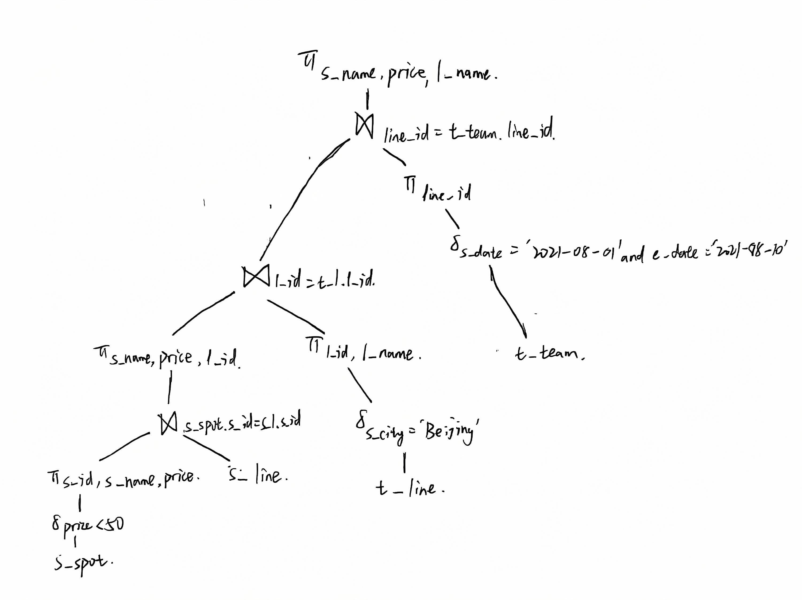

```sql
SELECT s.spot_name, s.price, t.line_name
FROM scenic_spot s
JOIN spot_line sl ON s.spot_id = sl.spot_id
JOIN tourism_line t ON sl.line_id = t.line_id
JOIN tourism_team tt ON t.line_id = tt.line_id
WHERE s.price < 50
  AND t.start_city = 'Beijing'
  AND tt.start_date = '2021-08-01'
  AND tt.end_date = '2021-08-10';
```

