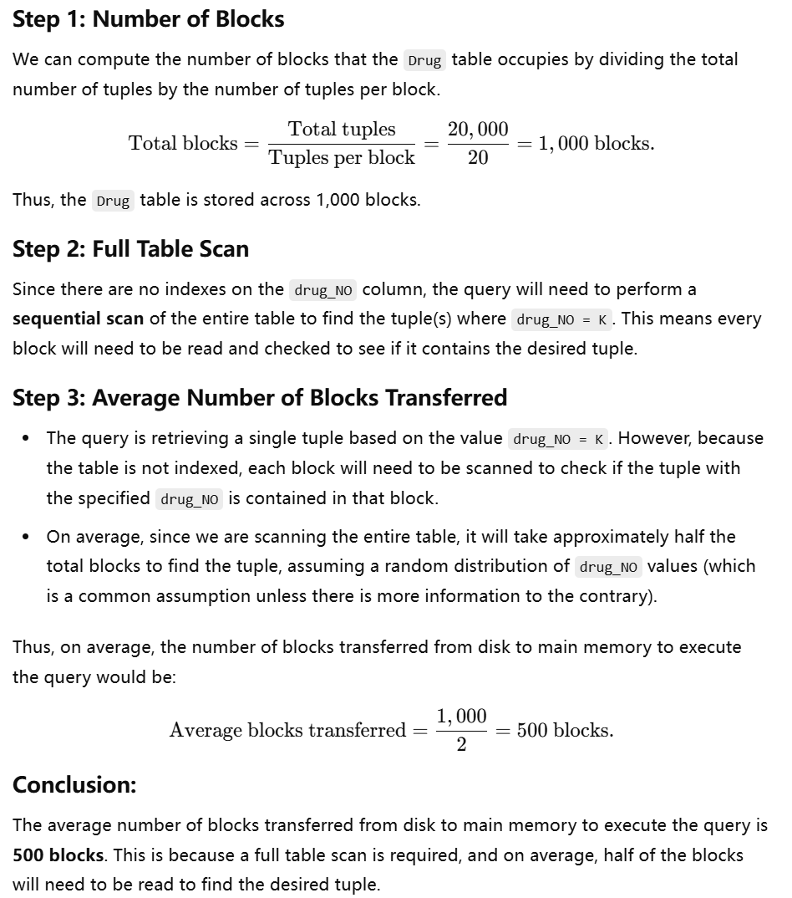

## PPT 1
- **（1）**

- **（2）**

## PPT 2
- **（1）**
因为查询条件中涉及了 `Department` 表的 `building` 字段和 `Student` 表的 `age`、`department` 字段
我们可以使用 `(building, department, age)` 作为一个索引进行加速, building 为单值, 我们将其作为第一索引, 对于 age 与 department: 以 department 进行 group by
我们用 department 作为第二索引以让对应的记录成块.

- **（2）**
建立在 `age` 上的索引减慢了这个 `update` 操作
每次 `age` 字段的值发生变化时，数据库都需要更新对应的索引，增加了额外的开销
并且查询条件只涉及了`sid` 字段

---

## 补充 1
- **（1）**
由于没有索引，数据库需要进行全表扫描
总共有 $\frac{20000}{20}=1000$ 个磁盘块
则执行查询的最多磁盘块数量为 1000，最少为 1
故执行查询的平均磁盘块数量为 500

- **（2）**
NameInd 是 non-clustering index
`drug_NO` 是主键，并且已经创建了聚集索引。因此，表中的记录是按照 `drug_NO` 的值进行物理排序的
而 `NameInd` 索引只是为 `name` 字段创建一个单独的索引结构，并不会影响表中数据的物理存储顺序

- **（3）**
除了 `drug_NO` 上的主键索引，还可以考虑在 `production_date` 和 `type` 字段上创建索引
因为查询条件涉及 `production_date` 属性，而分组又涉及 `type` 属性

- **（4）**
`NameInd` 索引不会加速这个插入操作，反而可能会减慢操作。
因为 NameInd 是 non-clustering index
在插入新记录时，更新 `NameInd` 索引可能会增加额外的开销