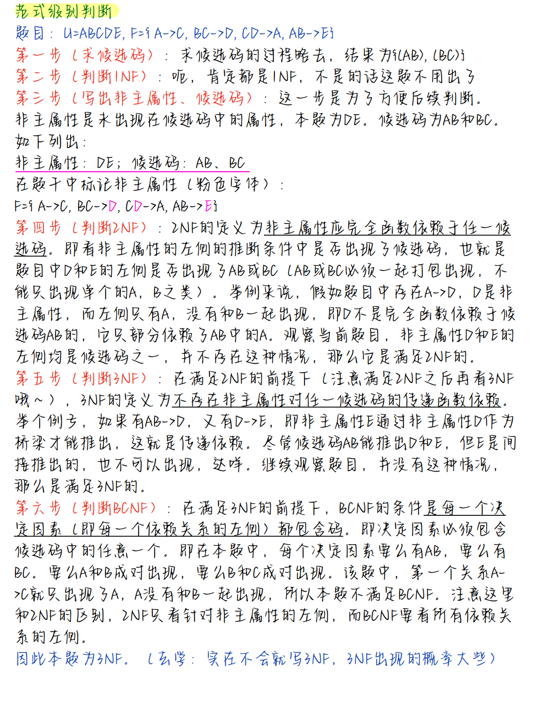

# Ch 1 Introduction
+ **DB:** database a collection of interrelated data
+ **DBMS:** DataBase Management System
+ **Applications** Set of programs to access the data

+ **Levels of Abstraction 数据抽象三个层次**
 > Physical level——最低层次，描述数据实际是怎样存储的
 > Logical level——描述存储什么数据以及数据间的关系
 > View level——最高层次

- **Data Independence 数据独立性**
 > **Physical Data Independence** 物理数据独立性：应用程序不依赖于*物理模式*。the ability to modify the physical schema without 	changing the logical schema or the views
 > **Logical Data Independence** 逻辑数据独立性：the ability to modify the logical schema without changing the logical views

+ **Instances and Schemas**
 > Schemas 模式——数据库的总体设计
 > > **Physical schema**: database design at the physical level;
 > > **Logical schema**: database design at the logical level;
 > 
 > Instances 实例——特定时刻存储在数据库中的信息的集合

+ **Database  Languages**
 > 

数据操纵语言 DML, Data Manipulation Language

---

# ch 2 Relational Model
## Relational Data Structure
+ 关系模型的数据结构——**关系 relation**

- **Relation Schema 关系模式**
 > 

+ **Relation Instance实例**
 > 
 > Order of tuples is **irrelevant** 行顺序无关
 > 列顺序无关
 > 属性是原子的 atomic
 > 属性名不同
 > 不同属性可来自相同域
 > 行不重复
 
+ **超键 superkey**
 > 一个或多个属性的集合，使可以在一个 relation 中唯一地表示一个 tuple
+ **候选键 candidate key**
 > minimal superkey 最小的超键
 > 存在多个
+ **主键、关键字 primary key**
 > one of the candidate keys
+ **Foreign Key 外键**
 > For $R_1$, $R_2$, 
 > $R_1$ includes the *Primary key X*  of  $R_2$, X is called a  **Foreign Key 外键** referencing $R_2$;  
 > $R_1$ is called the **referencing relation 参照关系** of the foreign key dependence;
 > $R_2$ is called the **referenced relation 被参照关系** of the foreign key ;

-  **Integrity Constraint**
 > **Integrity Constraint of Primary Key 实体完整性约束**
 > Each specified column of **primary key** is assumed to be  NOT  NULL.
 > **主键**不可以为空
 > **Referential Integrity constraint 参照完整性约束**
 > The FK-values in any tuple of relation r1 are either NULL or must appear as the PK-values of a tuple of relation r2.
 > 在关系r1中的任何元组的**外键**值要么是**NULL**，要么必须作为关系r2中某个元组的**主键值**出现。

## Fundamental Relational-Algebra-Operations
+ **Select 选择**
 > $\sigma_p(r)$ 中的 $p$ 就是 selection predicate
 > $\sigma_p(r)=\{t|t\in r\ and\ p(t)\}$
 > 

+ **Project 投影**
 > 一元操作
 > $\prod_{A1,A2...,Ak}(r)$ 其中，$A1$ 是属性名，r 是 relation name
 > 消去没有列出的列、消去重复的行
 
+ **Union 并**
 > $r\cup s$
 > 定义：$$r\cup s=\{t|t\in r\ or\ t\in s\}$$
 > **可并的条件**：
 > 1. 有相同的 attributes 的个数
 > 2. 对应的取值 domains 必须相容
 
+ **set difference 差**
 > $r-s$
 > 属于 r，不属于 s
 
+ **Cartesian product 笛卡尔乘积**
 > $r\times s$
 
+ **Rename 更名**
 > 
 
 ## Additional Relational-Algebra-Operations
+ **Set intersection 交**
 > $r\cap s$
 > 等于 $r-(r-s)$
 > 条件和 union相同
+ **(Natural) join（自然）连接**
 > Join 连接 
 > 自然连接 
+ **Division 除法** 简略讲
 > $r\div s$ 
+ **Assignment 赋值**
 > The assignment operation ($\leftarrow$) provides a convenient way to express complex queries, write query as a sequential program consisting of a series of assignments followed by an expression whose value is displayed as a result of the query.
+ **outer join 外连接**
 > 添加没有连接上的数据
 > 左外连接、右外连接，对于另外一边自己没有的属性，用 null 表示

- **Example**
 > 找到最大的 XXX
 > 自己笛卡尔自己，找到能够小于 XXX 的 turple，投影一下，再删除这些
 > 
## Modification of the Database
+ **Deletion**
 > $r\leftarrow r-E$
 > where r is a relation and E is a relational algebra query
+ **Insertion**
 > $r\leftarrow r\cup E$
 > where r is a relation and E is a relational algebra expression
+ **Upadting**
 > $r\leftarrow\prod_{F1,F2,...,Fi}(r)$

---

# ch 3 SQL
## 建表
### 格式
$$create\ table\ r (A_1 D_1, A_2 D_2, ..., A_n D_n,	(integrity\_constraint_1),		...,	(integrity\_constraint_k))$$
其中，
r is the name of the relation
each $A_i$ is an attribute name in the schema of relation r
$D_i$ is the data type of values in the **domain** of attribute $A_i$

### Integrity Constraints 完整性约束
+ **not null**
+ **primary key** ($A_1, ..., A_n$)
+ Foreign Key ($A_1, ..., A_n$) reference  table r on delete restrict/cascade/set NULL 
+ **check** (P), where P is a predicate


## Drop and Alter Table Constructs 删表&修改表
+ **drop table**
+ **Alter Table**
 > 用于向现有关系添加属性。
 > **alter table** r **add** A D

## Basic Structure__query 基础结构查询
+ 基本语法： 

+ \* 表示所有的属性：
 > select \*	from instructor

+ SELECT 子句可以包含涉及运算符 +、-、* 和 / 的算术表达式，并且可以对常量或元组的属性进行操作。
 > select ID, name, salary/12	 
 > from instructor
 > 将返回一个与 instructor 关系相同的关系，除了属性 salary 的值被除以 12。

+ **distinct**
 > 删去重复的
 > select **distinct** dept_name	from instructor

+ **all**
 > 不写默认保留
 > 不删去重复的
 > select **all** dept_name from instructor

+ **exist & not exist**
 > 

+ **where & between and**
 > select name
 > from instructor
 > where salary between 90000 and 100000
 > **等价于**
 > select name
 > from instructor
 > where salary $\geq$ 90000 and salary $\leq$ 100000
 
+ **The Rename Operation 重命名**
$$
old\_name\ as\ new\_name
$$

+ **自比较、自连接**
 > Find the names of all instructors who have a higher salary than some instructor in ‘Comp. Sci’.
 >> select distinct T.name
 >> from instructor as T, instructor as S
 >> where T.salary > S.salary and S.dept_name = ‘Comp. Sci.’

+ **String Operations**
 > **percent (%)**.  The % character matches any substring;
 > **underscore (\_)**.  The _ character matches any character;
 > 

+  **Ordering the Display of Tuples**
 > 默认是升序（asc）
 > 降序：desc
 > `order by name desc`
## Set Operations
+ **union**
+ **intersect**
+ **except**

## Aggregate Functions
+ **avg:** average value	
+ **min:**  minimum value
+ **max:**  maximum value
+ **sum:**  sum of values
+ **count:**  number of values

+ Aggregate Functions – **Group By**
 > Find the average salary of instructors in each department
 >> select dept_name, avg (salary) as avg_salar
 >> from instructor
 >> group by dept_name;
 >先分组，然后在每个分组上进行指定的聚集计算
 >**注意：** 出现在 select 但没有被 Aggregate的属性，必须出现在**group by**里

+ **Having clause**
 > 只跟在 group by 后面出现
 > 同样的，出现在 having 但没有被 Aggregate 的属性，必须出现在**group by**里

## Nested Subqueries 嵌套子查询
+ **无关子查询**
+ **相关子查询**

### Subqueries in the Where Clause
+ 通常用于：
 > For set membership 集合成员资格
 > For set comparisons 集合的比较
 > For set cardinality 
+ **set comparisons**
 > **“some” Clause**：“至少比某一个要大”用 > some 表示 
 > **“all” Clause**
 > 
 > **exists & not exists**：The exists construct returns the value **true** if the argument subquery is nonempty.
 > **unique & not unique**
 >  

### Subqueries in the From Clause

### With Clause
The with clause provides a way of defining a temporary relation whose definition is available only to the query in which the with clause occurs. 
提供定义**临时关系**的方法，该定义**只对包含 with 子句**的查询有效

### Subqueries in the Select Clause


## Deletion
+ **delete from**
 > 1. 直接删表里所有数据
 > 2. 加上 `where` 语句，删除特定数据

## Insertion
+ **Insert into Values ()**
```sql
insert into course (course_id, title, dept_name, credits) values 
('CS-437', 'Database Systems', 'Comp. Sci.', 4);
```
+ **批量插入**
 > Add all instructors to the student  relation with tot_creds set to 0
```sql
insert into student	
select ID, name, dept_name, 0
from instructor
```

## Update
Increase salaries of instructors whose salary is over $100,000 by 3%, and all others by a 5% 
这里的顺序不能调换
```sql
update instructor set salary = salary * 1.03 where salary > 100000;
update instructor set salary = salary * 1.05 where salary <= 100000;
```

---

# ch 4 Intermediate SQL
## Join  Expressions
+ **Natural Join operations 自然连接**
 > 连接条件用 `on` 连接 
 > 可以用等价的 `where` 语句替换 `join on`
 > we can use the **using** construct that allows us to specify exactly which columns should be equated
 
+ **Left/Right Outer Join**
 > 
 


## Views
`create view v as <query expression>`
+ **Update of a View**
 > Add a new tuple to faculty view 
+ **可更新的 view**
 > 

## Transactions


## Integrity Constraints
+ **not null**
+ **primary key**
+ **unique**
+ **check (P)**, where P is a predicate
 > 关系中的每个元组都必须满足谓词 P
+ **foreign key**
 > on delete restrict/cascade/set NULL 
 > **cascade：** 在父表上 update / delete记录时，同步 update / delete掉子表的匹配记录
 > **Restrict：** 如果子表中有匹配的记录, 则不允许对父表对应候选键进行update / delete操作
 > **set null：** 在父表上 update / delete记录时，将子表上匹配记录的列设为 null,要注意子表的外键列不能为 not null

## SQL Data Types and Schemas
+ **User-Defined Types**
 > 
- **Domains**
 > 

 ## Authorization
 

## Triggers

---

# ch 6 Database Design Using the E-R Model
## Outline of the ER Model
+ **主要三个要素**
 > entity sets
 > relationship sets
 > attributes
### Entity Sets 实体集
 > An **entity** is an object that exists and is distinguishable from other objects.
 > An **entity set** is a set of entities of the same type that share the same properties
 
 
### Attributes
+ **Simple** and **composite** attributes
 > 
+ **Single-valued** and **multivalued** attributes
 > Example: multivalued attribute: phone_numbers
+ **Derived** attributes
 > Can be computed from other attributes
 

### Relationship Sets
+ 指多个实体间的相互关联

- **Redundant Attributes 冗余属性**
 > 

+ Degree of a Relationship Set
 > 

### Mapping Cardinality Constraints 映射基数约束
+ 分为 1 对 1，1 对多，多对 1，多对多
+ total，partial
### 弱实体集 Weak Entity Sets
没有主键的实体集
A weak entity set is one whose existence is dependent on another entity, called its **identifying entity**
In E-R diagrams, a weak entity set is depicted via a **double rectangle**.
We underline the discriminator of a weak entity set with a **dashed line**.


## E -R Diagrams

### Cardinality Constraints 映射基数
+  
+ **Total**  and **Partial** Participation
 > 
+ Notation for Expressing More Complex Constraints
 >  
+  Notation to Express Entity with **Complex Attributes**
 > 

## Advanced Topics
### Specialization
在实体集内部进行分组的过程
+ **Disjoint（正交/不相交）**
 > an entity can belong to **only one** lower-level entity set
+ **Overlapping（重叠）**
 > an entity can belong to more than one lower-level entity set
- **total**
 > an entity must belong to one of the lower-level entity sets
- **partial**
 > an entity need not belong to one of the lower-level entity sets

 

### Generalization 特化/泛化
把特化反过来

Disjoint , total Specialization/Generalization
Disjoint, partial Specialization/Generalization
Overlapping, partial Specialization/Generalization
Overlapping, total Specialization/Generalization

### Aggregation 聚集

## Design Issues

+ 将多元联系转换为双元联系
 > 

## Reduction to Relation Schemas 转换为关系模式
强实体集直接转，弱实体集需要加入依赖的实体集的主键 
复合属性的每个子属性需要单独写出来
忽略多值属性，多值属性单独写一个模式EM，模式EM具有对应于E的**主键**的属性，以及一个对应于**多值属性**M的属性。

+ **Representation of Entity Sets with Composite Attributes**
 > 为每个子属性创建一个单独的属性

+ **Representing Relationship Sets 关系集**
 > 
 > **多对一和一对多**的关系集，如果在“多”侧是完全的（total），可以通过在“多”侧**添加一个额外的属性**来表示，该属性包含“一”侧的主键。
 > 对于**一对一**的关系集，可以选择任一侧作为“多”侧。
 > 也就是说，可以在对应于这两个实体集的任一表中添加一个额外的属性。如果“多”侧的参与是部分的（partial），那么用“多”侧对应的模式中的一个额外属性来替换一个模式可能会导致空值（null values）。

- **Redundancy of Schemas**
对应于将**弱实体集**与其识别强实体集链接起来的**关系集**的模式是冗余的。

---

# Chapter 7 Relational Database Design
+ **Functional Dependencies（函数依赖）**
 > 
 > **example**
 > > 

+ **Trivial  dependency 平凡依赖**
 > 

+ **Transitive  dependency 传递依赖**
 > 
 
+ **Partial  dependency 部分依赖**
 > 
 
+ **Logically imply逻辑蕴含**
 > 

+ Closure of a Set of Functional Dependencies（函数依赖集闭包）
 > $F^+$

+ **Armstrong’s Axioms**
 > 
+ **计算 $F^*$ 过程**
 > 
 
## Closure of Attribute Sets 属性集的闭包

+ **Uses of Attribute Closure**
 > 1. Testing for **superkey**
 > 2. Testing functional dependencies
 > 3. Computing closure of *F*
 > 
+ **Equivalent FD Sets**

## Canonical Cover /Minimal Cover 正则覆盖/最小覆盖
+ **Extraneous Attributes（无关属性）**
 > 
+ **Testing Extraneous Attributes**
 > 
+ **Canonical Cover/Minimal Cover**
 > 
 
## Normal Forms
### First Normal Form  1 NF

### Second Normal Form  2 NF
若 R 是 1 NF，且每个非键属性完全依赖于候选键，则称 R 为 2 NF（消除非键属性对候选键的部分依赖
A relation schema R is in second normal form (2 NF) if **each attribute A in R** meets **one** of the following criteria:
- It appears in a candidate key;
- It is not partially dependent on a candidate key.


 ### Third Normal Form  3 NF
 若 R 是 2 NF，且非键属性不传递依赖于 R 的候选键，则称 R 是第三范式。
 
###  Boyce-Codd Normal Form  BCNF

如果关系模式 R 是 1 NF，且每个属性都不部分依赖于候选键也不传递依赖于候选键，那么称 R 是 BC 范式。
If a relation is in BCNF it is in 3 NF

### 多属性依赖集候选关键字求法：
（1）将 R 的所有属性分为四类：
	L 类：仅出现在 F 的函数依赖左部的属性；
	R 类：仅出现在 F 的函数依赖右部的属性；
	N 类：在 F 的函数依赖左右两边均未出现的属性；
	LR 类：在 F 的函数依赖左右两边均出现的属性；
    并令 X 代表 L、N 类，Y 代表 LR 类；
（2）求 $X^+$，若包含了 R 的所有属性，则 X 即为 R 的唯一候选关键字，转（5），否则转（3）；
（3）在 Y 中取一属性 A，求 $(XA)^+$, 若它包含了 R 的所有属性，则转（4），否则，调换一属性反复进行这一过程，直到试完所有 Y 中的属性；
（4）如果已找出所有的候选关键字，则转（5），否则在 Y 中依此取两个、三个，…，求他们的属性闭包，直到其闭包包含 R 的所有的属性。
（5）停止，输出结果。

### 范式级别判断



## Decomposition
+ **Lossless-join decomposition 无损分解**
 > 分解时没有信息损失
+ **Dependency preservation 保持依赖**
 > 
 > 
+ **Testing for Dependency Preservation**
 > 
## 3 NF Decomposition Algorithm

## BCNF Decomposition Algorithm


---

# Chapter 13 Data Storage Structures

## File Organization
- **Fixed-Length Records**

- **Variable-Length Records**
 

 ## Organization of Records in Files

Records of each relation may be stored in a separate file. In a  **clustering file organization**（聚集）  records of several different relations can be stored in the same file

 ## Data -Dictionary Storage
Data dictionary (also called system catalog) stores **metadata**:  that is, data about data


+ **Column-Oriented Storage**
 > Store each attribute of a relation separately
 > 

---

# Chapter 14   Indexing
## Basic Concepts
- **Search Key** – An attribute or set of attributes used to look up records in a file.
- An **index file** consists of records (called **index entries**索引项) of the form 
- 两种基本的索引类型:
   - **Ordered indices**:  search keys are stored in sorted order
   - **Hash indices**:  search keys are distributed uniformly across “buckets” using a “hash function”. 
+ 评价因素：
    - Access types
    - Access time
    - Insertion time
    - Deletion time
    - Space overhead

## Ordered Indices: Primary index, Secondary index
- **Primary index（主索引）**: in a **sequentially ordered 有序文件** file, the index whose search key specifies the sequential order of the file.
   - Also called **clustering index 聚集索引**
   - The search key of a primary index is **usually** but not necessarily the primary key. 不一定建立在主键上，只要顺序一致即可
- **Index-sequential file**: ordered sequential file with a primary index.
- **Secondary index 辅助索引**: an index whose search key specifies an order **different from** the sequential order of the file.  Also called **non-clustering index**.

+ **Dense Indices 稠密索引**
 > 每一个 search key 值都有一个索引项 index entries
+ **Sparse Indices 稀疏索引**
 > 只为 search key 某些值建立索引项
 
- **Multilevel Index 多级索引**
 > **outer index** – a sparse index of primary index
 > **inner index** – the primary index file
+ **Index Update:  Deletion**
 > 
- **Index Update:  Insertion**
 > Perform a lookup using the search-key value appearing in the record to be inserted.
 > **Dense indices** –insert index/add pointer/update pointer
 > **Sparse indices** – no change / insert index / update pointer 

+ **Primary and Secondary Indices**
 > Secondary indices have to be dense
 > When a file is modified, every index on the file must be updated, Updating indices imposes overhead on database modification.

## B+-Tree Index
All paths from root to leaf are of the same length


- Special cases: 
 > If the root is not a leaf, it has at least 2 children.
 > If the root is a leaf (that is, there are no other nodes in the tree), it can have between 0 and (n–1) values.

+ **Queries on B+-Trees**
 > 
 
## Hash Indices


## Index Definition in SQL


---

# Chapter 15 Query  Processing
## Basic Steps in Query Processing
查询解析 Parsing and translation
查询优化 Optimization
查询执行 Evaluation

# Chapter 16 Query  Optimization
## Heuristic optimization（启发式优化）
### Equivalence Rules


1  选择、投影尽早执行，减少中间结果；
2  笛卡尔乘积和选择组合成连接操作；
3  相同关系的多个选择和投影操作可同时执行，减少扫描；
4  投影和相邻的操作结合，减少为投影而进行单独的 I/O 操作；
5  存储公共的常用的结果

- **步骤：**
 > **（1）构造查询树；**
 > **（2）按优化规则、变化规则进行优化。** 

- **查询树**
 >（1）表示关系代数表达式的语法树形结构；
 >叶节点：关系；
 >非叶节点：各种关系代数操作；
 >从底向上执行。
 >（2）从 SQL 构造查询树： 
 >FROM 对应笛卡尔乘积；
 >WHERE 对应选择操作；
 >SELECT 对应投影操作。
 
- **优化算法**
 > 输入：一个关系代数表达式的语法树；
 > 输出：计算表达式的一个优化程序。
 > 执行步骤：对查询树从顶至下优化：
 > （1）利用**选择串接律**，将**选择操作**分成单个独立；
 > （2）对于每个**选择操作**，利用选择的交换律、和投影的交换律、和连接/笛卡尔乘积的分配律、和集合操作的分配律，使其**尽可能移到靠近叶节点**；
 > （3）对于每个**投影操作**，利用投影串接律、和选择的交换律、和连接/笛卡尔乘积的分配律、和集合操作的分配律，使其**尽可能移到靠近叶节点或删除某些投影操作**；
 > （4）使用选择、投影的串接律，选择、投影的交换律，将串接的多个选择和投影组合成一个；
 > （5）利用笛卡尔乘积/连接/结合操作的结合律，按照小关系先执行的原则，安排操作顺序；
 > （6）组合笛卡尔乘积和相继的选择操作为连接操作；
 > （7）对每个叶节点加必要的投影操作，消除对查询无用的属性；
 > （8）分组。每个二元运算（笛卡尔乘积、连接、集合操作）与其直接祖先（不越过别的二元运算节点）的一元运算节点（投影、选择），分为一组，如其子孙节点一直到叶节点皆为选择或投影，也并入该组。使每组的操作可由单个存取程序完成。

---

# Chapter 17 Transactions 事务
## ACID Properties
Atomicity（原子性）
Consistency（一致性）
Isolation（隔离性）
Durability（保持性）

## Transaction State


## Implementation of Atomicity and Durability
## Concurrent Executions
## Serializability
- **Conflict Serializability**
 > 
 > 判断一个调度是否冲突可串行化：**Precedence graph 前驱图、优先图**  :
 > 

## Recoverability

## cascadeless 

## Implementation of Isolation
- Levels of Isolation in SQL-92
 > 
 > **脏读**：读到了别的事务回滚前的脏数据。
 > **不可重复读**：当前事务先进行了一次数据读取，然后再次读取到的数据是别的事务修改成功的数据，导致两次读取到的数据不匹配。
 > **幻读**：事务 A 首先根据条件查询得到 N 条数据，事务 B 改变了这 N 条数据之外的 M 条或者增添了 M 条符合事务 A 查询条件的数据，导致事务 A 再次搜索发现有 N+M 条数据了，就产生了幻读。
 > 当前事务读第一次取到的数据比后来读取到数据条目不一致。

---

# Chapter 18 Concurrency Control
- Lock-Based  Protocols 基于锁的协议
 > exclusive (X) mode
 > shared (S) mode
 
- The **Two-Phase Locking Protocol**
 > 
 > Lock Conversions

- **Multiple Granularity**
 > 
 > Intention Lock Modes
 > 
 > 加锁从根节点向下加，释放锁从下向上释放
 > IS: 子为 shared，父为 IS/S/IX/SIX
 > IX: 子为 exclusive，父为 IX/IS
 > SIX: 子为 X，父为 S, 则父应该为 SIX

- **Deadlock Prevention Strategies**
 > **wait-die** scheme：让老事务等待新事务
 > 
 > **wound-wait** scheme：回滚的是正在执行的事务
 > 

- **Deadlock Detection**

- **Deadlock Recovery**

---

# Chapter 19 Recovery System 


