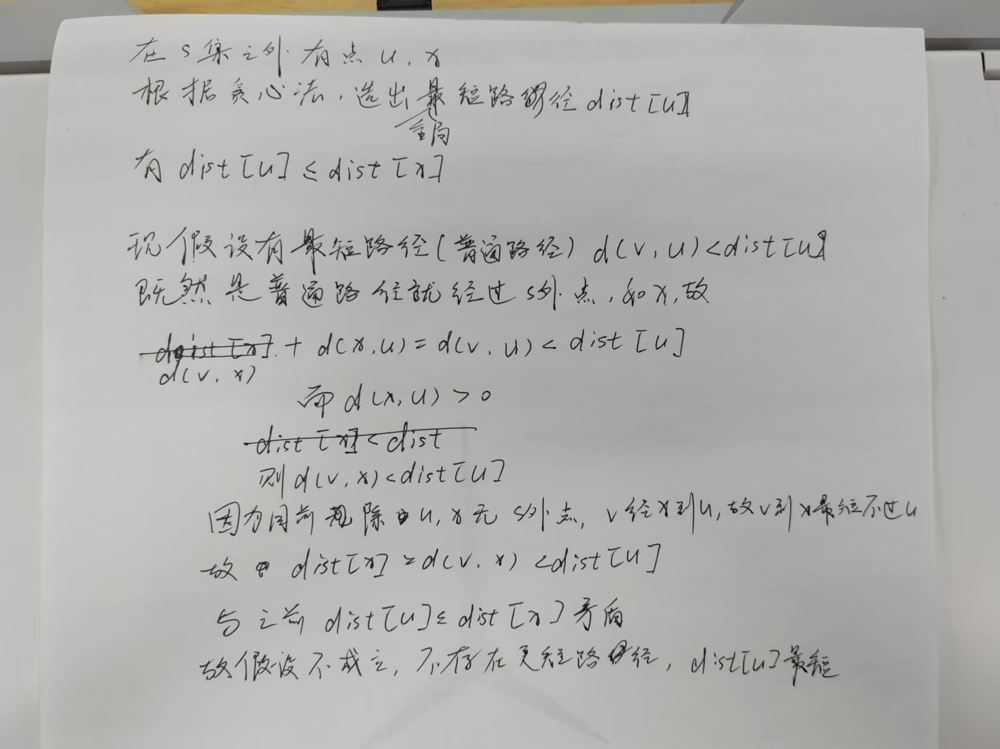

# 1 算法复杂性
**第一题 10 分**
证明题
只考时间复杂性，不考空间复杂性
渐进复杂性
**5 种：**
 > **渐进上界**：$O$, 存在常数 $C>0$ 和 $n_0$，使得函数 $f(n)$ 满足 $f(n)\leq C\cdot g(n)$ 对于所有的 $n\geq n_0$，记作 $f(n)=O(g(n))$，表示 $f(n)$ 的增长速度不会超过 $g(n)$ 的常数倍
 > **渐进下界**：$\Omega$, 存在常数 $C>0$ 和 $n_0$，使得函数 $f(n)$ 满足 $f(n)\geq C\cdot g(n)$ 对于所有的 $n\geq n_0$，记作 $f(n)=\Omega(g(n))$
 > 紧渐进界：$\Theta$, 存在常数 $C_1>0,\ C_2>0$ 和 $n_0$，使得函数 $f(n)$ 满足 $C_1\cdot g(n)\leq f(n) \leq C_2\cdot g(n)$ 对于所有的 $n\geq n_0$，记作 $f(n)=\Theta(g(n))$
 > 非紧上界：$o$, $f(n)$ 的增长速度**严格小于** $g(n)$ 的增长速度
 > 非紧下界：$\omega$, $f(n)$ 的增长速度**严格大于** $g(n)$ 的增长速度


按作业题+复习 PPT 的题复习

---

# 2 递归方程
**第二题 10 分**
线性齐次递归方程求解

注意：特征方程有重根的情况

1. 没重根
2. 有重根
   
---

# 3 分治法
**20 分**
原理 + 写代码 + 最好最坏**时间复杂性**（至少写出递归方程再给出结论）+ 计算示例 +  **拓展**（给出特定问题利用算法进行分析）

原理：
- **分解（Divide）**：将问题划分为若干个规模较小的子问题。
- **解决（Conquer）**：递归地解决子问题。如果子问题的规模足够小，直接求解。
- **合并（Combine）**：将子问题的解合并成大问题的解。

## **二分搜索**
将 n 个元素分成个数大致相同的两半，取 `a[n/2]` 与 `x` 做比较，如果 `x == a[n/a]`, 则找到 x，算法终止，如果 `x < a[n/2]`, 则只要在数组 a 的左半部继续搜索 x，否则在右半部继续搜索。然后在折半的规模里继续递归使用该算法。
（**拓展**：快速幂）
```cpp
int binarysearch(int []a, int x, int n) {
    int left = 0, right = n - 1;
    
    while (left <= right) {
        int mid = (left + right) / 2;
        if (x == a[mid]) return mid;
        if (x < a[mid]) right = mid - 1;
        else left = mid + 1;
    }

    return -1;
}
```

$$
T(N)=1T(N/2)+O(1)
$$
每执行一次算法的 while 循环，待搜索数组的大小减少一半。因此，在最坏情况下，while 循环被执行了 $O(logn)$ 次。循环体内运算需要 $O(1)$ 时间，因此整个算法在最坏情况下的计算时间复杂性为 $O(logn)$ 。

- **快速幂**
```CPP
int pow(int x, int n) {
    if (n == 0) return 1;
    if (isEven(n)) return pow(x * x, n/2);
    else return pow(x * x, n/2) * x;
}
```
## **快排**
选出一个标杆元素，小的放左边，大的放右边。解决退化问题（一个主要考点）、拓展（第四问，一般是**稳定排序相关**）（怎么把快排变成稳定排序）
```cpp
void quickSort(std::vector<int>& data, int low, int high) {
    if (low < high) {
        int pi = partition(data, low, high);
        quickSort(data, low, pi - 1);
        quickSort(data, pi + 1, high);
    }
}

int partition(std::vector<int>& data, int low, int high) {
    int pivot = data[low];  // 基准
    int i = low;

    for (int j = low + 1; j <= high; j++)
        if (data[j] < pivot)
            swap(data[++i], data[j]);

    swap(data[i], data[low]);

    return i;  // 返回分区点
}
```
不稳定，不退化 $O(nlogn)$ 

发生退化的情况，也就是我们选取的key，也就是partition，他一直是最大值或者最小值，那这时快排就变成了一个冒泡排序，就变成了 $O(n^2)$（比较了 $n(n-1)/2$ 次）
解决方法：不再选取第一个，随机选取，避免退化问题
## **合并排序**
（merge 函数在解决逆序对时很有用）
  **标准方法**：一分为二直到最小。从一个个小的数自底向上排序。
  **缺点：** 其实是没有意义的分解。
```cpp
void mergeSort(Comparable a[], int left, int right) {
   if (left < right) {//至少有2个元素
       int mid = (left + right) / 2;
       mergeSort(a, left, mid);
       mergeSort(a, mid + 1, right);
       merge(a, left, mid, right);
   }
}
void Merge(int arr[], int left, int mid, int right) { 
    int tempIndex = 0; 
    int leftIndex = left, rightIndex = mid + 1; 
    // 左子数组和右子数组的起始位置 
    
    while (leftIndex <= mid && rightIndex <= right) { 
    // 当两个子数组都未完全合并时 
    if (arr[leftIndex] < arr[rightIndex]) 
        temp[tempIndex++] = arr[leftIndex++]; 
    else
        temp[tempIndex++] = arr[rightIndex++]; 
    }  
    
    while (leftIndex <= mid) 
        temp[tempIndex++] = arr[leftIndex++]; 
    while (rightIndex <= right) 
        temp[tempIndex++] = arr[rightIndex++]; 
}
```

  **第二种办法**：一开始就消除分解，直接看成长度为 1 的序列
  在 merge 中，tempIndex 的初始值变了
```cpp
void Merge(int arr[], int left, int mid, int right) { 
    int tempIndex = left; 
    int leftIndex = left, rightIndex = mid + 1; 
    // 左子数组和右子数组的起始位置 
    
    while (leftIndex <= mid && rightIndex <= right) { 
    // 当两个子数组都未完全合并时 
    if (arr[leftIndex] < arr[rightIndex]) 
        temp[tempIndex++] = arr[leftIndex++]; 
    else
        temp[tempIndex++] = arr[rightIndex++]; 
    }  
    
    while (leftIndex <= mid) 
        temp[tempIndex++] = arr[leftIndex++]; 
    while (rightIndex <= right) 
        temp[tempIndex++] = arr[rightIndex++]; 
}

// 此时合并的区间大小为s
void MergePass(int arr[], int temp[] int s, int n) {
    int i = 0;
    
    // 合并大小为 s 的相邻两个子数组
    while (i <= n - 2 * s) {
        Merge(arr, temp, i, i + s - 1, i + 2 * s - 1);  // 合并 arr[i..i+s-1] 和 arr[i+s..i+2s-1]
        i = i + 2 * s;
    }

    // 处理剩下的元素
    if (i + s < n)
        Merge(arr, temp, i, i + s - 1, n - 1);  // 如果剩下的元素多于 s，进行一次合并
    else
        // 如果剩下的元素少于 s，直接将剩余元素复制到 temp[]
        for (int j = i; j <= n - 1; j++)
            temp[j] = arr[j];
}

void MergeSort(int arr[], int n) {
    int* temp = new int[n];
    int s = 1;

    // 不断增大合并的区间大小 s，直到 s >= n
    while (s < n) {
        MergePass(arr, temp, s, n);  // 合并大小为 s 的相邻子数组
        s *= 2;  // 增加合并的区间大小
        MergePass(temp, arr, s, n);  // 继续合并
        s *= 2;  // 再次增加合并的区间大小
    }
}
```

在每一轮合并中，整个数组都会参与合并，因此每轮合并的时间复杂度是 $O(n)$，而合并的次数是 $O(\log n)$（每次合并的子数组大小翻倍）
- 最坏/平均的时间复杂度为 $O(n \log n)$。
稳定排序
## **线性时间选择（其实是快排的拓展）**
如果能在线性时间内找到一个划分基准，使得按这个基准所划分出的 2 个子数组的长度都至少为原数组长度的 ε 倍 ($0<ε<1$ 是某个正常数)，那么就可以在最坏情况下用 $O (n)$ 时间完成选择任务，这是线性时间选择问题
将待排数列分组，组内排序，再将组间排序（通用方法：每五个元素一组，每一组排序后，每一组都有一个中间元素，再把每一个中间元素放在一起，取出中间元素的中间元素，就是解决退化问题的 partition 元素）
退化问题相关：一个定理
```cpp
// k为在p~r范围内，需要找到的第k个元素
int Select(int a[], int p, int r, int k) {
    if (r - p < 75) {
        用某个简单排序算法对数组a[p:r]排序;
        return a[p + k - 1];
    }
    
    for (int i = 0; i <= (r - p - 4) / 5; i++ ) // (r-p-4)/5 = (r-p+1)/5 - 1
         将a[p + 5 * i]至a[p + 5 * i + 4]的第3小元素与a[p + i]交换位置;
    // 找中位数的中位数，r-p-4即上面所说的n-5
    int x = Select(a, p, p + (r - p - 4) / 5, (r - p - 4) / 10);
    int i = Partition(a, p, r, x),
    j = i - p + 1;    // 现在找到了第 j 小
    if (k <= j) return Select(a, p, i, k);
    else return Select(a, i+1, r, k - j);
}
```


---

# 4 动态规划
**20 分**
原理 + **证明最优子结构（5 分）**（反证法）+ 写出**递推/状态方程（5 分）**+ 代码 + 时间复杂性

原问题的最优解包含了其子问题的最优解，即原问题可以由子问题的最优解组合而成，这就使得问题可以拆分成若干个子问题。

 ## **矩阵连乘**
- 证明最优子结构
 > 假设不满足最优子结构，当前 `A[i:j]` 最优： `A[i:k]` 和 `A[k+1,j]` 
 > 因为不满足最优子结构，所以可能存在 `A'[i:k]` 比 `A[i:k]` 更小，那么替换 `A[i:k]` ，发现当前 `A[i:j]` 不是最优，矛盾，所以一定是最优子结构
- 状态方程
 > 对于计算 $A[i:j]$, 设需要的最少数乘次数为 `m[i][j]`，则原问题的最优解为 `m[1][n]`
 > 对于矩阵 $A_i$，我们认为他的维数为 $p_{i-1}\times p_{i}$
 > 当 $i=j$ 时，就是矩阵自己，得到 `m[i][i]=0`
 > 当 $i<j$ 时，$m[i][j]=m[i][k]+m[k+1][j]+p_{i-1}\times p_k\times p_j$
$$
m[i][j]=
\begin{cases}
0\ \ \ \ \ i=j\\
\min_{i\leq k\leq j}\{m[i][k]+m[k+1][j]+p_{i-1}\times p_k\times p_j\}\ \ \ i<j
\end{cases}
$$

- 代码
```cpp
 // p[]为矩阵下标，n为矩阵个数，m[][]为所求次数，s[][]为划分点
void MatrixChain(int* p, int n, int **m, int **s) { 
    for (int i = 1; i <= n; i++)        
        m[i][i] = 0;

    for (int r = 2; r <= n; r++)  // r个为一组
        for (int i = 1; i <= n - r + 1; i++) {
            int j = i + r - 1;          // 初始化m[i][j]表示(Ai×..×Aj)
            m[i][j] = m[i + 1][j] + p[i - 1] * p[i] * p[j];
            s[i][j] = i;  // 初始化，在 Ai 加括号
            for (int k = i + 1; k < j; k++) {
                int t = m[i][k] + m[k + 1][j] + p[i - 1] * p[k] * p[j];
                if (t < m[i][j]) {
                    m[i][j] = t;
                    s[i][j] = k;
                }
            }
        }
}

// 输出最优计算次序
void traceback(int i, int j, int **s) {
    if (i == j)
        return;

    traceback(i, s[i][j], s);
    traceback(s[i][j] + 1, j, s);
    cout << "Multiply A" << i << "," << s[i][j];
    cout << "and A" << s[i][j] + 1 << "," << j << endl;
}
```

- 时间复杂度
$O(n^3)$


## **最长公共子序列**
有坑，例子可能不止一个，要都找出来
- **证明最优子结构**
 > 假设不满足最优子结构，当前 $X=\{x_1,x_2...x_m\}$ 和 $Y=\{y_1,y_2,...,y_n\}$ 的最长公共子序列为 $Z=\{z_1,z_2...z_k\}$
 > 我们假设 $z_k$ 的位置在 X 和 Y 中为 i, j，则对于 `X[1:i]` 和 `Y[1:j]`，我们认为有更长的子序列 `Z'[1:k-1]` 比当前的 `Z[1:k-1]` 更长，那么我们直接替换这部分，发现 $Z'+z_k$ 比最长公共子序列还长，矛盾
 > 故一定满足最优子结构
- **状态方程**
 > 对于 `X[1:i]` 和 `Y[1:j]`，`c[i][j]` 表示当前的最长子序列的长度
$$
c[i][j]=
\begin{cases}
0\ \ \ \ \ \ \ \ \ \ \ \ \ \ \ \ i=0 或 j=0\\
c[i-1][j-1]+1\ \ \ \ x_i=y_j\\
\max\{c[i][j-1],c[i-1][j]\}\ \ \ x_i\neq y_j
\end{cases}
$$
 
- **代码**
```cpp
//计算最优值
void LCSLength(int m, int n,const string& x,const string& y, int** c, int** b) {
    //c[][]记录最长公共子序列长度，b[][]记录c[][]由哪个子问题得到
    int i, j;
    for (i = 0; i <= m; i++)
        c[i][0] = 0;
    for (j = 0; j <= n; j++)
        c[0][j] = 0;

    for (i = 1; i <= m; i++)
        for (j = 1; j <= n; j++) {
            if (x[i-1] == y[j-1]) {
                c[i][j] = c[i - 1][j - 1] + 1;
                b[i][j] = 1;
            } else if (c[i - 1][j] >= c[i][j - 1]) {
                c[i][j] = c[i - 1][j];
                b[i][j] = 2;
            } else {
                c[i][j] = c[i][j - 1];
                b[i][j] = 3;
            }
        }
}

//构造最长子序列
void LCS(int i, int j, const string& x, int** b) {
    if (i == 0 || j == 0)
        return;

    if (b[i][j] == 1) {
        LCS(i - 1, j - 1, x, b);
        cout << x[i - 1];
    } else if (b[i][j] == 2)
        LCS(i - 1, j, x, b);
    else
        LCS(i, j - 1, x, b);
}
```

- **时间复杂度**
$O(n^2)$
## **最大子段和**
找出最大和值的子段元素；找出起始元素和结束元素都靠前的（倒着找）

- **证明最优子结构**（还需要完善逻辑）
 > 对于数组 `a[1:j]` 当前最大子段和为 `a[i:j]` 或 `a[i:k]`，那么对于数组 `a[1:j-1]`
 > 如果满足最优子结构，那么局部最大字段和一定是 `a[i:j-1]` 或 `a[i:k]`
 > 假设不满足最优子结构，则存在新的和比上述和大，那么对于 `a[i:k]`，矛盾
 > 对于 `a[i:j-1]` 的情况，`a[i:j-1]` 一定大于 0，那么新的和应该包含 `a[i:j-1]`，那么原来的最大和应该在包含 `a[i:j]` 的基础上，再加上新的和多出来的部分，得到更大的和，矛盾
 > 故一定是最优子结构
- **状态方程**
设$b_i$是这串数字中以$a_i$结尾的连续数字串求和的最大值，那么，最优解具有下面的特点：
- 如果 $b_i\geq0$，那么 $b_{i+1}=a_{i+1}+b_i$，此时连续数字串“可以保持增长”
- 如果 $b_i\leq0$，那么 $b_{i+1}=a_{i+1}$，此时以 $a_{i+1}$ 作为最后一个数字的连续数字串不能包括前面的数字，这会使得求和值反而更小
$$
b[i]=\max\{b[i-1]+a[i],\ a[i]\}
$$

- **代码**
```cpp
int MaxSum(int n, vector<int>& a) {
    int sum = 0, b = 0;
    for (int i = 0; i < n; i++) {
        if (b > 0)
            b += a[i];
        else
            b = a[i];

        if (b > sum)
            sum = b;
    }

    return sum;
}

// 找出起始元素和结束元素都靠前的（倒着找）
void getMax(vector<int>& a, int n) {
    int B, E, Max;  // B为子数组的起始点下标,E为子数组的结束点下标
    int b, tmp;
    b = Max = a[n - 1];
    B = n - 1;
    E = n - 1;
    tmp = n - 1;
    for (int i = n - 2; i >= 0; i--) {
        if (b > 0)
            b += a[i];
        else {
            b = a[i];
            tmp = i;
        }
        if (b >= Max) {
            Max = b;
            E = tmp;
            B = i;
        }
    }
  
    cout << "最大子段和为：" << Max << endl;
    cout << "起始下标为：" << B << endl;
    cout << "结束下标为：" << E << endl;
}
```

- **时间复杂度**
$O(n)$
## **0-1 背包问题**
肯定不考优化
- **证明最优子结构**
 > 
- **状态方程**
`dp[V]`：表示背包容量为 `V` 时，能够获得的最大价值。
对于每个物品 `i`，如果背包容量 `V` 足够容纳该物品（即 `V >= w[i]`），则有两种选择：
1. **不选择物品 `i`**，那么最大价值就是 `dp[V]`，即保持原值不变。
2. **选择物品 `i`**，那么最大价值是 `dp[V - w[i]] + v[i]`，即背包容量减少 `w[i]` 后，剩余容量能得到的最大价值，加上物品 `i` 的价值 `v[i]`。
因此，状态转移方程可以写为：
$$dp[V] = \max(dp[V],\ dp[V - w[i]] + v[i])$$

- **代码**
```cpp
void put(int* w, int* v, int W, int n) {
    int dp[10] = { 0 };

    for (int i = 0; i < n; i++)
        for (int V = W; V >= w[i]; V--) {
            dp[V] = max(dp[V], dp[V - w[i]] + v[i]);
        }

    /*
    int max = 0;
    for (int i = 0; i <= W; i++)
        if (dp[i] > max)
            max = dp[i];
    */
    cout << dp[V] << endl;
}
```

- **时间复杂度**
$O(n^2)$

---

# 5 贪心
**20 分**
原理 (采用的**贪心策略**) + 证明**贪心选择性质：在每一步选择中，做出当前最优的选择，且这个局部最优的选择能保证整个问题的最优解。** (假定从其他方法获得了最优解，套路) + 代码 (排序+循环) + 时间复杂性（确定了贪心选择性质后，需要排序，因为有排序，所以一定是 $O(n\log n)$，不要被自己的代码骗了）

每个例子的贪心策略是什么

在算法进行过程中，当面临选择时，总是作出在当前看来最好的选择

## **活动安排**
- **贪心策略**
> 选择最早结束的活动，基于这个策略，按照**活动结束时间排序**，活动 1 必须，下一个活动不仅当前最早结束，且要和前面相容。

- **贪心选择性质**：反证法。
 > 假设用别的方法得到活动集合 A，假设第一个活动不是活动 1（为什么强调活动 1？因为是必选），但 A 数量最优，但是第一个不是活动 1，那么把该活动换为活动 1，此时相容，且活动 1 更早结束。
 > 得到证明最优解 A 也可以从活动 1 开始，那剩下的用归纳证明即可。
 >  

- **代码**
```cpp
//s为起始时间，f为结束时间，按照结束时间顺序排列
template<class Type>
void GreedySelector(int n, Type s[], Type f[], bool A[]){
    A[1] = true;
    int j = 1;    // 当前安排下安排的最后一个活动
    for (int i = 2; i <= n; i++){
        // 如果剩余活动中，活动i结束时间最早且当前已安排的最后1个活动j相容，则安排i
        if (s[i] >= f[j]) { // 起始时间在结束时间之后
            A[i] = true;
            j = i;
        }
        else 
            A[i] = false;
    }
}
```

## **最优装载问题**
n 个集装箱，载重量为 c 的轮船。求最大的装载数量。贪心策略：选最轻的集装箱优先装。
  把所有集装箱排序，依次选择轻的
- **贪心策略**
 > 先装重量最轻者，船的剩余可装载（重量）容量最大化，以容纳更多的其它集装箱，产生最优解

- **贪心选择性质**
 >   
- **代码**
```cpp
//x为解向量
void Loading(int x[], Type w[], Type c, int n){
    int* t = new int[n+1];
    Sort(w, t, n);
    // 按照重量w[i]从小到大重新排序并排列编号，结果放在t
    for(int i = 1;i <= n;i++) x[i] = 0;
    
    for(int i = 1; i <= n && w[t[i]] <= c; i++){
        x[t[i]] = 1;
        c -= w[t[i]];
    }
}
```

## **单源最短路径**
每一次找特殊路径中最小的那个。
  证明：挑出来的是最短的，假设不是，则存在一个更小的不特殊路径（反证法）
- **贪心策略**
 > 
- **贪心选择性质**
 > 
- **代码**
```cpp
void Dijkstra(typec cost[][MAXN], int dist[], int n, int V) {
    // 初始化数组，设置所有顶点的最短路径为INF，所有顶点未被访问，前驱节点为-1
    for(int i = 0; i < n; i++) {
        dist[i] = INF;  // 设置最短路径初始化为INF
        vis[i] = false; // 标记所有顶点为未访问
        S[i] = -1;      // 前驱节点初始化为-1
    }
    
    // 起始节点的最短路径设置为0
    dist[V] = 0;
    
    // 遍历所有节点，进行n-1次松弛操作
    for(int j = 0; j < n; j++) {
        int k = -1;
        int Min = INF;

        // 在未访问的节点中选择距离起点最近的节点k
        for(int i = 0; i < n; i++) {
            if(!vis[i] && dist[i] < Min) {
                Min = dist[i];
                k = i;
            }
        }
        
        // 如果没有找到最小距离的节点，说明所有节点已处理完，提前退出
        if(k == -1) break;
        
        // 标记节点k为已访问
        vis[k] = true;
        
        // 更新与节点k相连的其他节点的最短路径
        for(int i = 0; i < n; i++) {
            if(!vis[i] && dist[k] + cost[k][i] < dist[i]) {
                // 如果通过节点k到达i的路径更短，则更新dist和S
                dist[i] = dist[k] + cost[k][i];
                S[i] = k;
            }
        }
    }
}
```

- **时间复杂度**
$O(n^2)$
## **背包问题**
部分背包问题（这里不是 0-1）
**证明仿照最优装载**
- **贪心策略**
 > 每次挑性价比最高的（按照性价比排序）
 > 计算每种物品的**价值密度—单位重量价值** $v_i/w_i$ ，作为贪心选择的依据指标

- **贪心选择性质**
 > 
- **代码**
```cpp
void Knapsack(int n, float M, float v[], float w[], float x[], int N[]){
    Sort(n, v, w);
    
    int i;
    for (i = 1; i <= n; i++) x[i] = 0;
    float C = M;
    for (i = 1; i <= n; i++) {
        if (w[i] > C) break;
        x[i] = 1;
        c -= w[i];
    }
    
    //如果还有物品没有考虑且背包还有剩余容量，将剩余容量分配给物品i
    if(i <= n && C > 0) 
        x[i] = C / w[i];
}
```

---

# 6 回溯法
**20 分**
代码不做要求！
原理 + **解向量设计** + **剪枝函数设计** + 时间复杂度 + **解空间树**

**子集树**：$O(2^n)$, 0-1 背包（n 个物品，选出一个子集）
**排列树**：$O(n!)$, 所给的问题是确定n个元素满足某种性质的排列

**解向量**：问题的解能够表示成一个 n 元式 $(x_1, x_2,…, x_n)$ 的形式

## **n 皇后问题**-排列树
不存在最优解的问题--->剪枝函数
- **解向量**：一个等长向量 n 维（每一维代表一行（数组下标）），每一维的**取值**代表在哪一列
- **剪枝函数**：不在同一行：i 维不能等于 j 维（$i\neq j$），不在同一列： $x_i\neq x_j$，不在斜线：$|i-j|\neq |x_i-x_j|$
 
## **0-1 背包问题**-子集树
- **解向量**： n 维，取值不是 0 就是 1。用一个 n 元组 C=(c<sub>1</sub>, c<sub>2</sub>, …, c<sub>n</sub>) 来描述每一种物品的选择情况，其中，c<sub>i</sub>∈{0，1}(1≤i≤n) 表示是否装入背包物品 i 。
- **剪枝函数**：剪得是左子树（不能超重），右子树（求最优解）
  

## **旅行商问题 TSP**-排列树
- **解向量**：用一个 n 元组 C=(c<sub>1</sub>, c<sub>2</sub>, …, c<sub>n</sub>) 来描述第 i 个访问的城市为 c<sub>i</sub>。
- **剪枝函数**：
 > **剪枝条件一**：当$i<n$时，如果`x[i]`添加到当前路径已经不小于当前最优路径，则不再继续搜索，`cv + w[x[i-1], x[i]] <= v_best`
 > **条件二**：当 $i<n$ 时，如果 i 与其子结点之间没有边，即路径长度`w[x[i-1]，x[i]]`为正无穷时，剪枝。

 

## **图的 m 着色问题**-子集树
- **解向量**：n 维（n 个顶点），每一维的取值就是颜色数. 用一个 n 元组 C=(c<sub>1</sub>, c<sub>2</sub>, …, c<sub>n</sub>) 来描述图的一种可能着色，其中，c<sub>i</sub>∈{1, 2, …, m}(1≤i≤n) 表示赋予顶点 i 的颜色。
- **剪枝函数**：相邻城市之间不能同一个颜色（课件里有动画）如果相邻的节点没有上相同的颜色，那么接着处理；要么剪去，重新选择颜色

